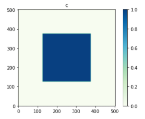
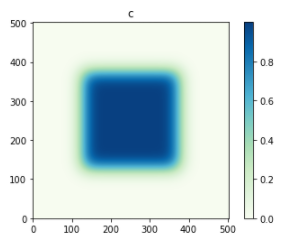

How to use pyphasefield: Diffusion Engine
=========================================

In the previous example, a non-functional script was shown to illustrate the possible functions which may be used. To demonstrate the usage, 
we will illustrate this process with an example script, using the built-in Diffusion pyphasefield engine.

The Code
~~~~~~~~

.. code-block:: python

	#built for pyphasefield version 1.1.0, may not work on future versions!
	import pyphasefield.Engines as engines

	sim = engines.Diffusion(dimensions=[500, 500])

	#initialize non-array parameters
	sim.set_framework("CPU_SERIAL") #"CPU_SERIAL", "GPU_SERIAL" (GPU_SERIAL requires numba)
	sim.set_dx(1.)
	sim.set_dt(0.1)
	sim.set_save_path("data/diffusion_test")
	sim.set_autosave_flag(True)
	sim.set_autosave_save_images_flag(True)
	sim.set_autosave_rate(2000)
	sim.set_boundary_conditions("PERIODIC")

	data = {
		"D":1.
	}
	sim.set_user_data(data)

	#initialize simulation arrays, all parameter changes should be BEFORE this point!
	sim.initialize_fields_and_imported_data()

	#change array data here, for custom simulations
	"""
	sim.fields[0].data[:] = 1.
	length = sim.dimensions[0]
	width = sim.dimensions[1]
	sim.fields[0].data[length // 4:3 * length // 4, width // 4:3 * width // 4] = 0.
	"""

	#initial conditions
	sim.plot_simulation()

	#run simulation
	sim.simulate(2000)

	#final conditions
	sim.plot_simulation()
	
Results
~~~~~~~

	
Downloads
~~~~~~~~~
:download:`Jupyter Notebook <Diffusion_Example.ipynb>`